  

  
  

## Tech Stack

<table>
<tr>
  <td align="center" width="150"><b>Backend</b></td>
  <td align="center" width="150"><b>Frontend</b></td>
  <td align="center" width="150"><b>Database</b></td>
  <td align="center" width="150"><b>DevOps</b></td>
  <td align="center" width="150"><b>GameDev</b></td>
</tr>
<tr>
  <td align="center">
     
    C#
  </td>
  <td align="center">
     
    HTML
  </td>
  <td align="center">
     
    PostgreSQL
  </td>
  <td align="center">
     
    Docker
  </td>
  <td align="center">
     
    Unity
  </td>
</tr>
<tr>
  <td align="center">
     
    .NET
  </td>
  <td align="center">
     
    CSS
  </td>
  <td align="center">
     
    SQLite
  </td>
  <td align="center">
     
    Git
  </td>
  <td>
  </td>
</tr>
<tr>
  <td align="center">
     
    Python
  </td>
  <td align="center">
     
    React
  </td>
  <td></td>
  <td></td>
  <td></td>
</tr>
<tr>
  <td align="center">
     
    FastAPI
  </td>
  <td align="center">
     
    Figma
  </td>
  <td></td>
  <td></td>
  <td></td>
</tr>
</table>

## GitHub Stats

  
  

  

  <picture>
    <source media="(prefers-color-scheme: dark)" 
srcset="https://raw.githubusercontent.com/platane/snk/output/github-contribution-grid-snake-dark.svg"
 />
    <source media="(prefers-color-scheme: light)" 
srcset="https://raw.githubusercontent.com/platane/snk/output/github-contribution-grid-snake.svg"
 />
    
  </picture>

  

